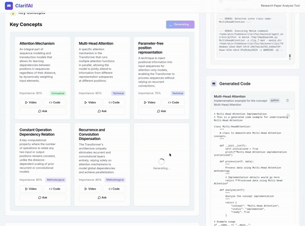
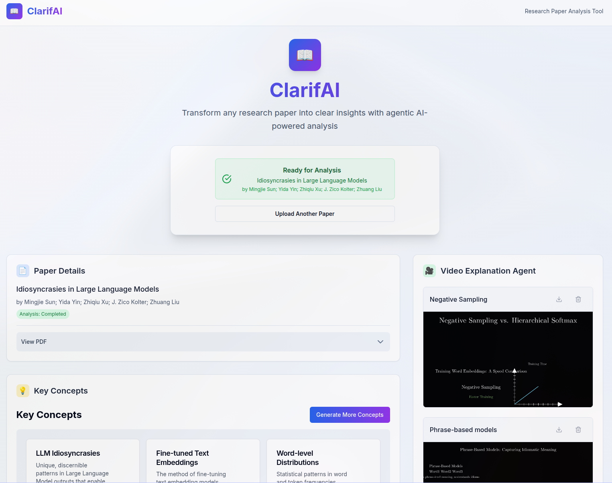
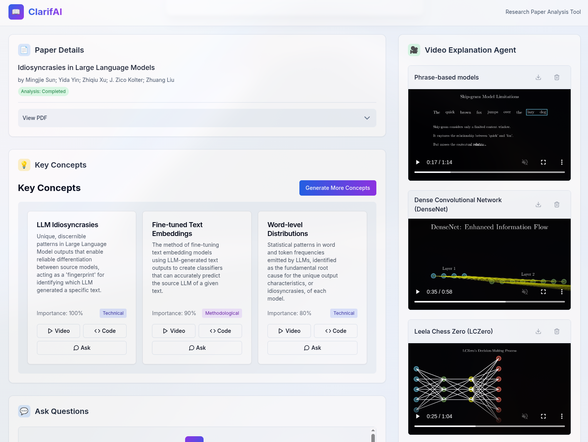
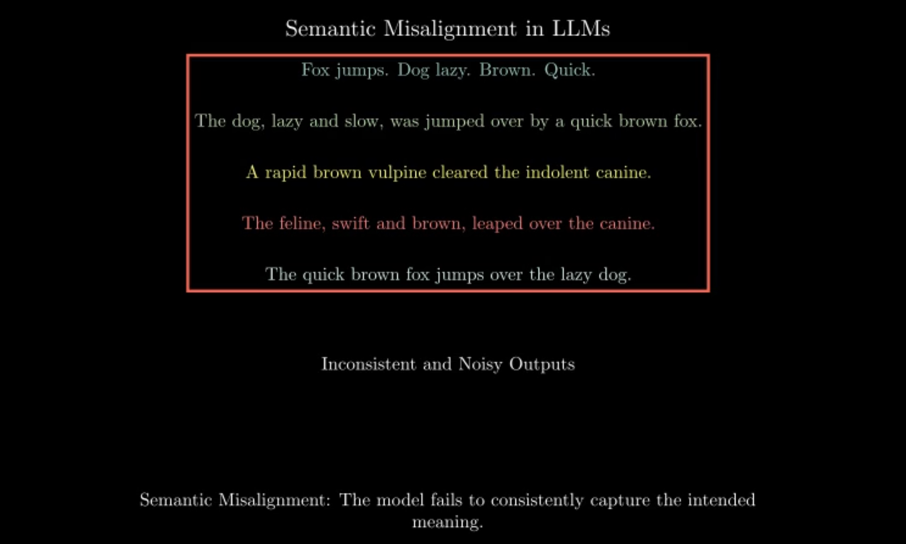
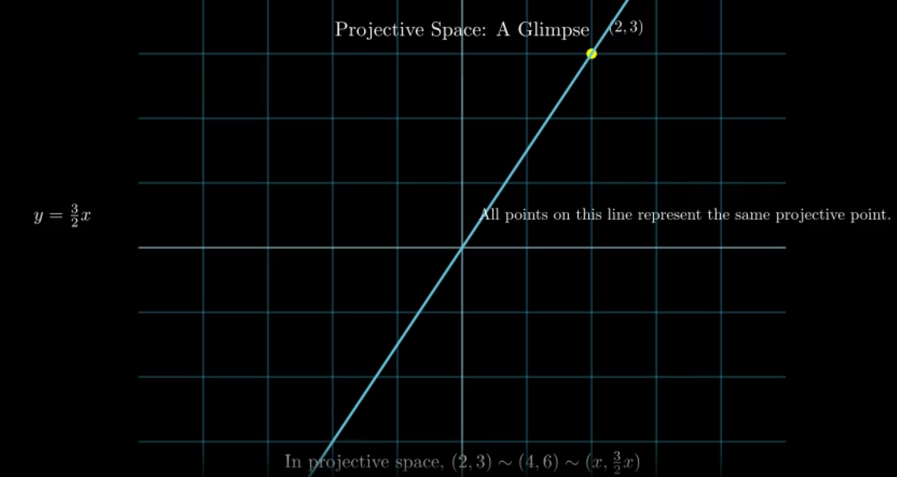

# ClarifAI

Deconstruct complex research papers into digestible concepts and automatically generate video explanations in the style of 3blue1brown. 

---

## Demos

<table>
  <tr>
    <td align="center"><b>Workflows</b></td>
    <td align="center"><b>UI</b></td>
  </tr>
  <tr>
    <td>
      <a href="media/demo.mp4">
        
      </a>
    </td>
    <td>
      <a href="media/landing2.png">
        
      </a>
    </td>
  </tr>
</table>

### These are clips generated for specific concepts.

| The Weight Monodromy Conjecture | Word Embeddings |
| :---: | :---: |
| <a href="media/demo1.mp4"></a> | <a href="media/demo2.mp4"></a> |

| RNNs vs CNNs | Bellman's Equations |
| :---: | :---: |
| <a href="media/demo3.mp4"></a> | <a href="media/demo4.mp4"></a> |

---

### The video generation agent panel.



### Examples of generated Manim animation frames.

<div align="center">
<table>
  <tr>
    <td align="center">
      
    </td>
    <td align="center">
      
    </td>
  </tr>
</table>
</div>

---

## Features
- **PDF Upload & Analysis**: Upload research papers in PDF format for comprehensive AI-powered analysis.
- **Key Concept Extraction**: Automatically identifies and extracts core concepts, methodologies, and insights from the text using Google's Gemini Flash.
- **Agentic Video Generation**: A LangChain agent uses Manim to generate high-quality, 3blue1brown-style animations for each concept.
- **Self-Correcting Code Generation**: The agent makes up to three attempts to generate and render Manim code, analyzing the previous error to correct itself.
- **Intelligent Scene Splitting**: An initial AI call intelligently splits a complex concept into multiple thematic scenes to create a more structured and understandable video narrative.
- **Multi-Clip Video Stitching**: Successfully rendered video clips are automatically stitched together into a final, complete video using ffmpeg.
- **Resilient Workflow**: The video generation process is fault-tolerant; if a single scene fails to render after multiple attempts, it is skipped, and the final video is created from the successful scenes.
- **Real-time Logging**: A WebSocket connection provides a message-by-message stream of the agent's entire process (prompts, AI responses, errors, and render commands) directly to the frontend.
- **AI-Powered Code Implementation**: Generate functional Python code examples for any extracted concept.
- **Responsive UI**: A clean and responsive frontend built with Next.js and Tailwind CSS provides a seamless user experience.

## Tech Stack
- **Frontend**: Next.js, React, TypeScript, Tailwind CSS
- **Backend**: FastAPI, Python, Uvicorn
- **AI/ML**: Google Gemini Flash, LangChain
- **Video Generation**: Manim Community v0.18.1
- **Video Processing**: ffmpeg
- **Environment Management**: uv for isolated Python environments, npm for dependency management.

## Prerequisites
Before you begin, ensure you have the following dependencies installed on your system.

### 1. General
- **Git**: For cloning the repository.
### 2. Backend Dependencies
- **Python 3.12 & 3.13**: The application requires two different Python versions. The main backend uses Python 3.13, while the video generation agent requires Python 3.12.
- **`uv`**: A fast Python package installer and resolver. 
  - **Installation**: `curl -LsSf https://astral.sh/uv/install.sh | sh`
- **`ffmpeg`**:
  - **macOS**: `brew install ffmpeg`
  - **Linux**: `sudo apt-get update && sudo apt-get install ffmpeg` or `sudo pacman -S ffmpeg`
  - **Windows**: `choco install ffmpeg` or `scoop install ffmpeg`
### 3. Frontend Dependencies
- **Node.js**: Version 18.x or later.
- **npm**: Usually installed with Node.js.

## Setup and Installation
1.  **Clone the Repository**
    ```bash
    git clone https://github.com/qtzx06/clarifai
    cd clarifai
    ```

2.  **Configure Environment Variables**
    Copy the example environment file and add your API key.
    ```bash
    cp .env.example .env
    ```
    Now, open the `.env` file and add your Google Gemini API key:
    ```
    GEMINI_API_KEY="YOUR_API_KEY_HERE"
    ```

3.  **Make Scripts Executable**
    This step is required for Linux and macOS users.
    ```bash
    chmod +x start.sh stop.sh
    ```

4.  **Run the Application**
    A single script handles all dependency installation and server startup.
    ```bash
    ./start.sh
    ```
    This script will:
    - Create and populate two separate Python virtual environments (`./backend/venv` and `./backend/agent_env`) using `uv`.
    - Install all Python dependencies using `uv pip`.
    - Install all Node.js dependencies using `npm`.
    - Create the necessary storage directories (`/backend/clips`, `/backend/videos`).
    - Start the backend and frontend servers in the background.

    Once the script is finished, the application will be running:
    - **Frontend**: [http://localhost:3000](http://localhost:3000)
    - **Backend API**: [http://localhost:8000/docs](http://localhost:8000/docs)

## Usage
1.  Open your web browser and navigate to `http://localhost:3000`.
2.  Upload a research paper using the file uploader.
3.  Wait for the AI analysis to complete. Key concepts will appear on the right.
4.  On any concept card, click **"Video"** to trigger the agentic video generation process or **"Code"** to generate a Python implementation.
5.  You can monitor the real-time progress of the video agent in the "Video Explanation" panel.

## Stopping the Application
To stop both the frontend and backend servers, run the `stop.sh` script from the project root:
```bash
./stop.sh
```

## Project Architecture
The application is composed of three main parts:

1.  **Frontend**: A Next.js application that provides the user interface for uploading papers, viewing concepts, and watching the generated videos.
2.  **Backend**: A FastAPI server that handles file uploads, orchestrates the analysis and video generation process, and serves the final videos.
3.  **Agent**: A standalone Python script (`run_agent.py`) that operates in an isolated environment. It communicates with the Gemini API to generate Manim scripts and then renders them into video clips. Said isolation prevents dependency conflicts between Manim and the main backend.

The backend and agent communicate via a streaming subprocess pipeline, with logs and results sent back to the backend in real-time and then relayed to the frontend over a WebSocket connection.
